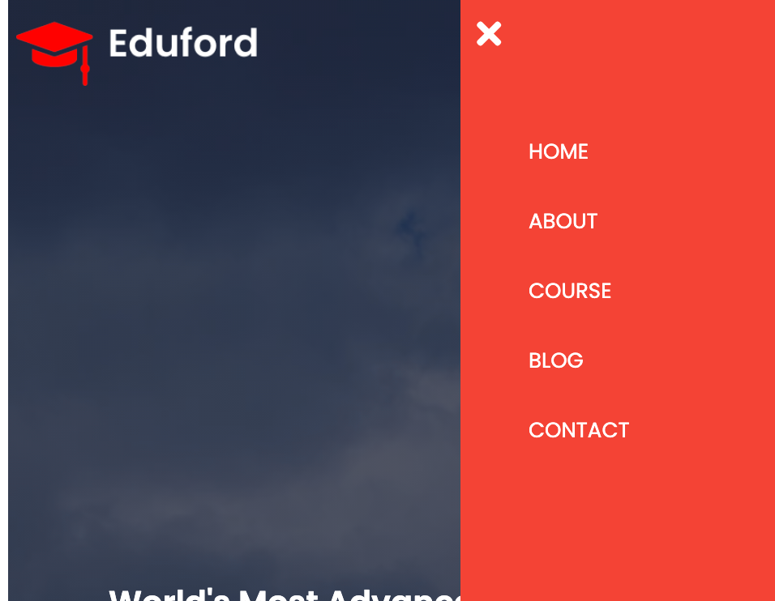
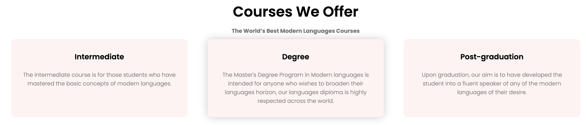
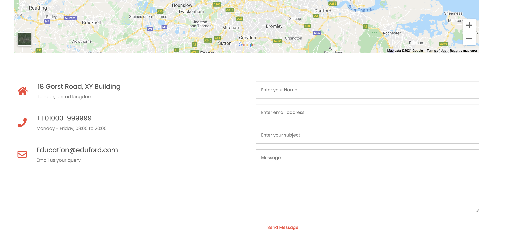

# Eduford University Website
Eduford is a unversity website that hopes to provide people information, content and support for people
who are interested in applying to one of the courses at Eduford University. This website hopes to cover all the content
needed for new students aswell as foreign students. Eduford is useful for students who want to join a modern language course.

## Features
This website was designed with responsive, simplistic and clear features that will help users navigate through the website for the information needed at ease.

### Existing Features

- __Navigation menu__

   - Featured on all five pages, the full responsive navigation 
    bar includes links to the Logo, Home page, Course page, Blog and Contact page and is 
    identical in each page to allow for easy navigation.
   - The navigation menu is responsive even on small screen devices.
    
#### Nav-bar :

#### Phone devices will show a 3 dot menu, which will open up a drop down menu when clicked :

- __Header__

   - Opening page header include a a clear background of the university's location and the unversity's logo.
   - This section introduces the user to Eduford and Eduford's slogan.
   - A "Visit Us To Know More" button is included, to take the user directly to the contact page, where location is provided.
  

- __Eduford offers__
   
   - 3 panel section is included in the home page, when hovered over gives a pop effect.
   - Provides the user with short vital information about some of what Eduford offers.

- __Campus Locations__
  - Includes 3 images of the cities where Eduford is located at.
  - When hovered over an image, name of the City shows up.

  

 - __Facilities Section__
   - Includes 3 images of the facilities Eduford offers.
   - Text underneath each image providing the user with information regarding the facilities.

 

- __Reviews Section__

  - Student reviews section.
  - Includes 2 review comments made from student in regards to Eduford.

 

- __Call To Action Section__

  - Includes a background image of the class and Enroll with us text.
  - Contact Us button, when clicked it takes the user to the contage page, where the user will be able to submit a message to Eduford.

- __Footer__

  - Footer section that's spread out across all pages, includes all social media links to Eduford.
  - Includes founding information of Eduford.

  

 - __About Page__

   - Provides user with information regarding Eduford Staff.
   - "Explore Now" button takes the user to course page.

  

   - __Certificate page__

     - Provides user with details of the course, courses and ect points.
     - Include a form where user can leave a comment. (Non functional currently)

 

- __Certificate page__

   - Contact page including address and contact information to Eduford.
   - Includes a required form where a user can leave a message.

   